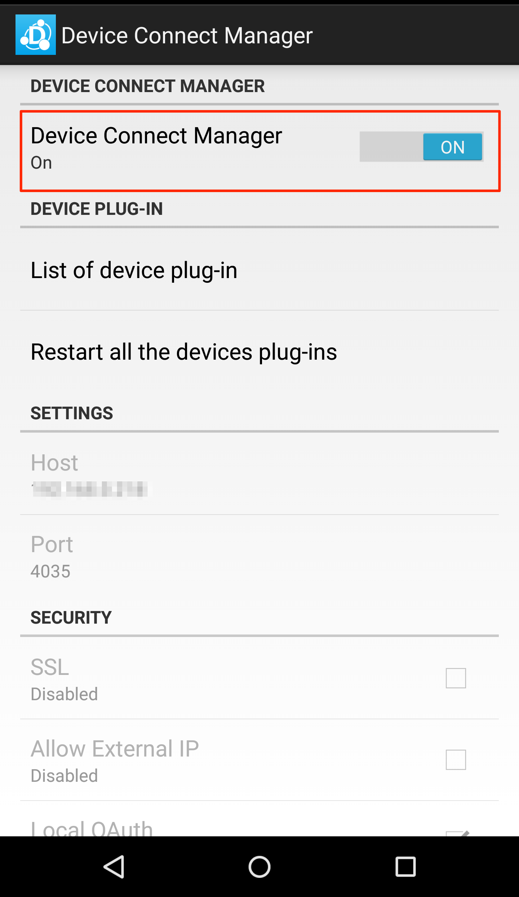
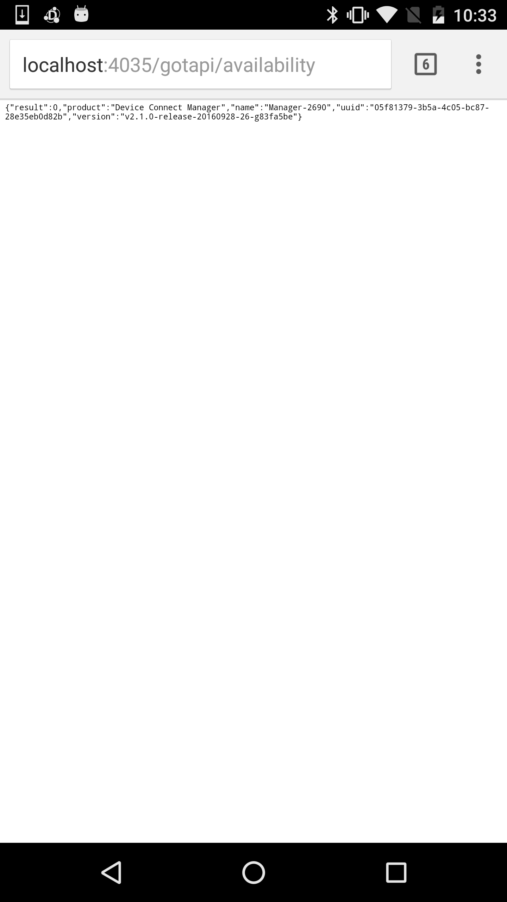
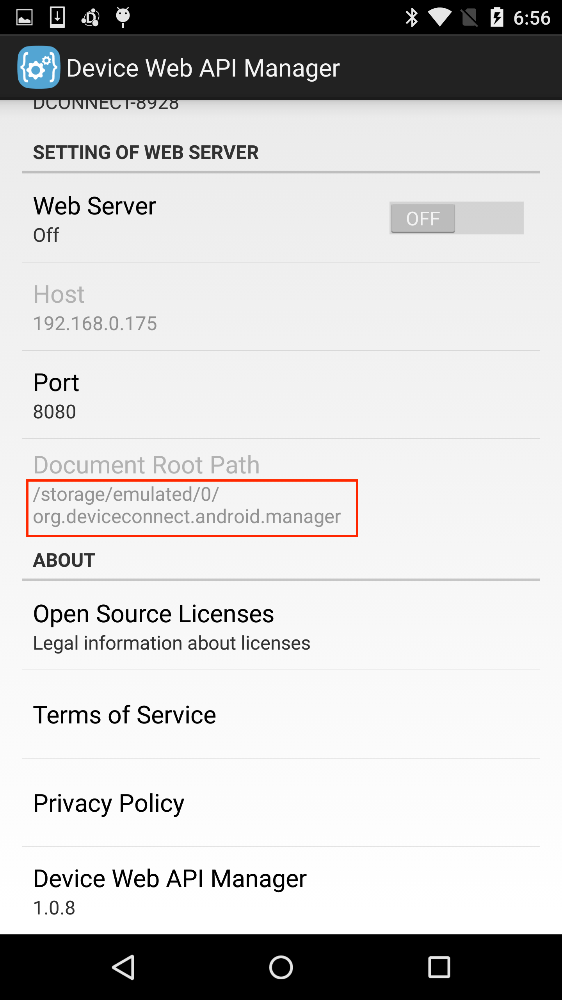
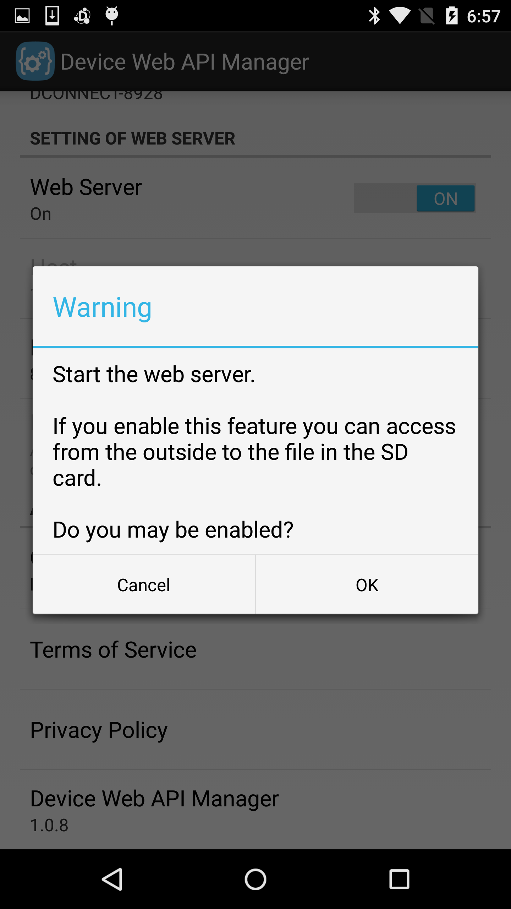

# DeviceConnect-Android
* 日本語説明はこちら
https://github.com/DeviceConnect/DeviceConnect-Android/blob/master/readme.ja.md

# About DeviceConnect WebAPI
"DeviceConnect WebAPI" is WebAPI which operates as a virtual server on a smart phone. It can use easily various wearable devices and an IoT device by unific description from a web browser or an application.

# About DeviceConnect Android

Device Connect WebAPI in WebAPI which operates as a virtual server on the smartphone, it can be easy to use in a uniform description of various wearable devices and IoT devices from a Web browser and apps.
Device Connect Android will be the platform of DeviceConnect of Android version.

In this guide I will continue to discuss the following.

* [Project description](#section1)
* [Installation of project](#section2)
* [Start of DeviceConnectManager](#section3)
* [Operation check](#section4)
* [Starting the Web server](#section5)
* [Development of DeviceConnect app](#section6)

# <a name="section1">Project description</a>
## dConnectDevicePlugin
| Project Name|Content  |
|:-----------|:---------|
|dConnectDeviceAllJoyn|Device Plug-in for AllJoyn.|
|dConnectDeviceAWSIoT|Plug-in for AWSIoT.|
|dConnectDeviceChromeCast|Device Plug-in for ChromeCast.|
|dConnectDeviceFPLUG|Device Plug-in for F-PLUG.|
|dConnectDeviceFaBo|Device Plug-in for FaBo.|
|dConnectDeviceHeartRate|Device Plug-in for HeartRate such as Mio Alpha.|
|dConnectDeviceHitoe|Device Plug-in for Hitoe.|
|dConnectDeviceHost|Device Plug-in for Android.|
|dConnectDeviceHue|Device Plug-in for Hue.|
|dConnectDeviceHVC|Device Plug-in for HVC-C.|
|dConnectDeviceHVCC2W|Device Plug-in for HVC-C2W.|
|dConnectDeviceHVCP|Device Plug-in for HVC-P.|
|dConnectDeviceIRKit|Device Plug-in for IRKit.|
|dConnectDeviceKadecot|Device Plug-in for Kadecot.|
|dConnectDeviceLinking|Device Plug-in for Linking.|
|dConnectDevicePebble|Device Plug-in for Pebble.|
|dConnectDeviceSonyCamera|Device Plug-in for SonyCamera such as QX10.|
|dConnectDeviceSonySW|Device Plug-in for SonySmartWatch<br>※SmartWatch3 is not supported.|
|dConnectDeviceSlackMessageHook|Plug-in for Slack.|
|dConnectDeviceSphero|Device Plug-in for Sphero.|
|dConnectDeviceTheta|Device Plug-in for THETA.|
|dConnectDeviceUVC|Device Plug-in for UVC Camera.|
|dConnectDeviceAndroidWear|Device Plug-in for AndroidWear.|
|dConnectDeviceWebRTC|Device Plug-in for WebRTC.|
|dConnectDeviceTest|Device Plug-in for test of DeviceConnect.|
|dConnectDevicePluginSDK|SDK for creating DevicePlugin. dConnectSDKForAndroid necessary.|

## dConnectManager
| Project Name | Content  |
|:-----------|:---------|
|dConnectManager|Platform body of DeviceConnect.|
|dConnectManagerTest|Test of DeviceConnectManager.|
|dConnectServer|Server interface library of DeviceConnect.|
|dConnectServerNanoHttpd|Server of the body of the DeviceConnect.|

## dConnectSDK
| Project Name | Content |
|:-----------|:---------|
|dConnectApp|DeviceConnect operation check for app.|
|dConnectSDKForAndroid|SDK of DeviceConnect. DevicePlugin development and SDK to be used for application development.|

# <a name="section2"> Installation of the application</a>
People who want to develop the DeviceConnectManager and device Plug-ins, please build in accordance with this build instructions.

* [DeviceConnectManager](https://github.com/DeviceConnect/DeviceConnect-Android/wiki/DeviceConnectManager-Build)
* [AllJoyn](https://github.com/DeviceConnect/DeviceConnect-Android/wiki/AllJoyn-Build)
* [ChromeCast](https://github.com/DeviceConnect/DeviceConnect-Android/wiki/ChromeCast-Build)
* [F-PLUG](https://github.com/DeviceConnect/DeviceConnect-Android/wiki/F-PLUG-Build)
* [FaBo](https://github.com/DeviceConnect/DeviceConnect-Android/wiki/FaBo-Build)
* [HeartRate](https://github.com/DeviceConnect/DeviceConnect-Android/wiki/HeartRateDevice-Build)
* [Hitoe](https://github.com/DeviceConnect/DeviceConnect-Android/wiki/Hitoe-Build)
* [Host](https://github.com/DeviceConnect/DeviceConnect-Android/wiki/Host-Build)
* [Hue](https://github.com/DeviceConnect/DeviceConnect-Android/wiki/Hue-Build)
* [HVC](https://github.com/DeviceConnect/DeviceConnect-Android/wiki/HVCDevice-Build)
* [HVC-C2W](https://github.com/DeviceConnect/DeviceConnect-Android/wiki/HVCC2WDevice-Build)
* [HVC-P](https://github.com/DeviceConnect/DeviceConnect-Android/wiki/HVCPDevice-Build)
* [IRKit](https://github.com/DeviceConnect/DeviceConnect-Android/wiki/IRKit-Build)
* [Kadecot](https://github.com/DeviceConnect/DeviceConnect-Android/wiki/Kadecot-Build)
* [Linking](https://github.com/DeviceConnect/DeviceConnect-Android/wiki/Linking-Build)
* [Pebble](https://github.com/DeviceConnect/DeviceConnect-Android/wiki/Pebble-Build)
* [SonyCamera](https://github.com/DeviceConnect/DeviceConnect-Android/wiki/SonyCamera-Build)
* [SonySW](https://github.com/DeviceConnect/DeviceConnect-Android/wiki/SonySW-Build)
* [Sphero](https://github.com/DeviceConnect/DeviceConnect-Android/wiki/Sphero-Build)
* [Theta](https://github.com/DeviceConnect/DeviceConnect-Android/wiki/Theta-Build)
* [UVC](https://github.com/DeviceConnect/DeviceConnect-Android/wiki/UVC-Build)
* [AndroidWear](https://github.com/DeviceConnect/DeviceConnect-Android/wiki/AndroidWear-Build)
* [WebRTC](https://github.com/DeviceConnect/DeviceConnect-Android/wiki/WebRTC-Build)
* [AWSIoT](https://github.com/TakayukiHoshi1984/DeviceConnect-Android/wiki/AWSIoT-Build)
* [SlackMessageHook](https://github.com/TakayukiHoshi1984/DeviceConnect-Android/wiki/SlackBot-Build)

　In addition, you can get the apk from [here] (https://github.com/DeviceConnect/DeviceConnect-Docs/tree/master/Bin/Android).
　With regard to the installation method, you can run from the command line of the command as follows.<br>
　Here, I will install only the Device Manager body and HOST device plug-ins.
　Because there are other devices plug-in, please install it if necessary.

```
　adb install dConnectManager.apk
　adb install dConnectDeviceHost.apk
```

With regard to the adb command, please make sure the Android SDK.

# <a name="section3">Start of DeviceConnectManager</a>
 Please tap the DeviceConnectManager icon.
 <center><a href="./assets/icon.png" target="_blank">
</a><br></center>

By making it ON the field of DeviceConnectManager, you can start.

<center><a href="./assets/manager_setting_ja.png" target="_blank">
</a></center>

# <a name="section4">Operation check</a>

The address of the Chrome browser, "http://localhost:4035/gotapi/availability" Please enter.
If Kore response is returned in the following, such as JSON, I can confirm that DeviceConnect is running.<br>
<br>

<center><a href="./assets/availability.png" target="_blank">
</a></center>

 Request

 ```
 GET http://localhost:4035/gotapi/availability
 ```

 Response

 ```
 {
     "product":"Device Connect Manager",
     "version":"x.x",
     "name":"Manager-0702",
     "uuid":"xxxx-yyyyy-zzz-aaaa",
     "result":0,
}
 ```

The API of the non-availability, basically you will not be able to check easily is the address of the chrome browser in order to access token is required.
Regard specific use of Device Connect, please refer to us the Wiki of [here] (https://github.com/DeviceConnect/DeviceConnect-Android/wiki/Application-Manual).

# <a name="section5">Starting the Web server</a>
Place the [DeviceConnect-JSのdConnectJavascriptApp](https://github.com/DeviceConnect/DeviceConnect-JS/tree/master/dConnectJavascriptApp) to the SD card of the Android device, you can access.
You can start the Web server by turning ON the following items of the setting screen of dConnectManager.<br>
Document root at that time, will be directly under org.deviceconnect.android.manager of SD card.<br>

<center><a href="./assets/webserver_setting_en.png" target="_blank">
</a></center><br>
If you place the HTML file to the `/storage/emulated/0/org.deviceconnect.android.manager/index.html`, in the browser, it can be accessed by entering the URL as `http://localhost:8080/index.html`.<br>
<br>
At that time, this function because there is a possibility that a security hole, looks like confirmation dialog is displayed as follows.<br>
<br>

<center><a href="./assets/webserver_en.png" target="_blank">
</a></center><br>

# <a name="section6">Development of DeviceConnect app</a>
Application and using the DeviceConnect, regard the development of the application, please refer to the following pages.

* [Application Development Manual(AndroidStudio)](https://github.com/DeviceConnect/DeviceConnect-Android/wiki/Application-Manual-for-Android-Studio)

<br>
If you want to develop a device plug-ins using the Device Connect Manager, please see this Application Development Manual.

* [Device Plug-in development manual(AndroidStudio)](https://github.com/DeviceConnect/DeviceConnect-Android/wiki/DevicePlugin-Manual-for-Android-Studio)
