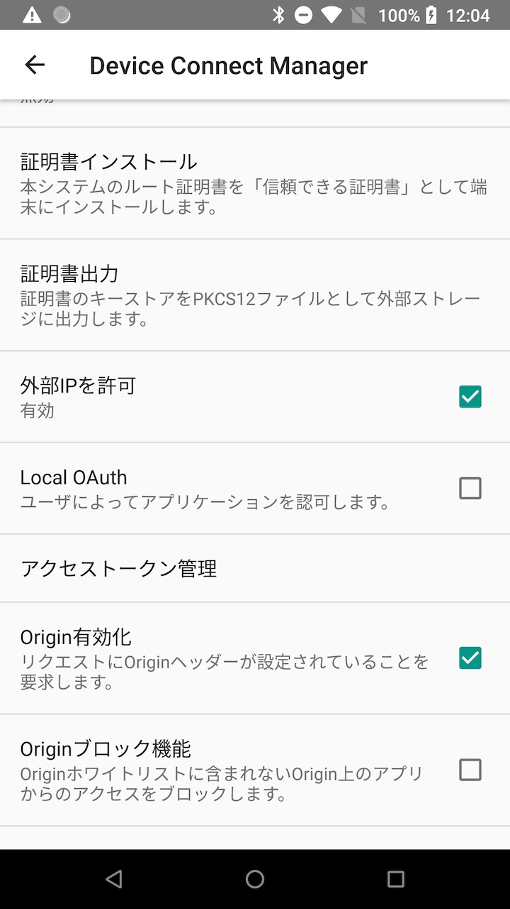
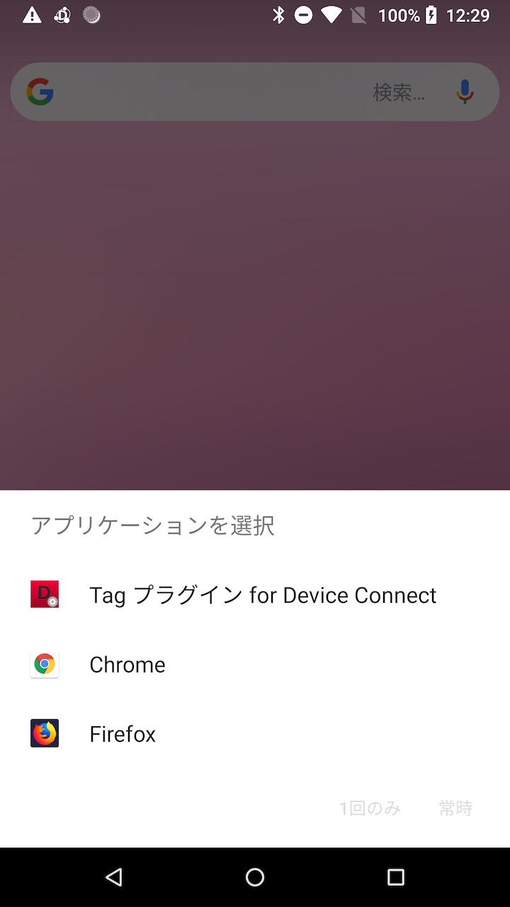
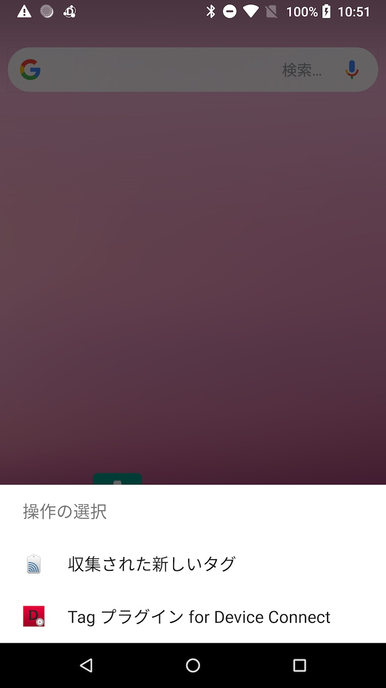

<link href="./assets/custom.css" rel="stylesheet"></link>

# Tag プラグイン

このプラグインは、NFC、QRコードなどのタグ情報にアクセスするための機能を提供します。

## 開発環境
Android Studio 3.2 以上

## サポートするプロファイル
- tag

## 関連ページ
- [Device Connect プラグイン開発マニュアル](https://github.com/DeviceConnect/DeviceConnect-Android/wiki/DevicePlugin-Manual-for-Android-Studio-110)

## ビルド手順
ここでは、Tag プラグインのビルド手順を説明します。

Tag プラグインのフォルダで作業を行います。

```
$ cd {WORKSPACE}/dConnectDevicePlugin/dConnectDeviceTag
```

{WORKSPACE} は、DeviceConnect-Android レポジトリをクローンしたフォルダを指定します。

### リリースビルド

gradle.properties に keystore の情報を記入します。<br>
keystore は、keytool などのコマンドを使用して用意してください。

```
storeFile=YOUR_STORE_FILE
storePassword=YOUR_STORE_PASSWORD
keyAlias=YOUR_KEY_ALIAS
keyPassword=YOUR_KEY_PASSWORD
```

以下のコマンドを実行することで、リリースビルドすることができます。

```
$ ./gradlew assembleRelease
```

gradlew にパーミッションがない場合には、以下のコマンドでパーミッションを追加します。

```
$ chmod +x gradlew
```

ビルドに成功した場合には以下のフォルダに apk が作成されます。

```
$ cd ./plugin/build/outputs/apk/release/plugin-release.apk
```

### デバッグビルド

デバッグ用にビルドする場合には以下のコマンドを実行します。

```
$ ./gradlew assembleDebug
```

ビルドに成功した場合には以下のフォルダに apk が作成されます。

```
$ cd ./plugin/build/outputs/apk/debug/plugin-debug.apk
```

## 使い方

プラグインを試す時に認可を求めるダイアログが表示されると手順が増えてしまうので、認可の設定を OFF にしていることを前提に説明します。

### Manager 認可について

Manager の認可を OFF にする場合には、Manager の設定画面を開き、<b><font color="red">Local OAuth</font></b> の項目からチェックを外すことでできます。

また、外部の PC などからもアクセスできるように<b><font color="red">外部IPを許可</font></b>の項目にはチェックを入れます。

<div style="text-align: center;">
	<a href="./assets/manager_setting2.jpg">
	    
	</a>
</div>

Local OAuth の設定を変更するには、Manager に OFF にする必要がありますので、ご注意ください。

### プラグイン認可について

使用する前にユーザに認可を求める設定があります。<br>
この設定が ON になっている場合には、使用する前にユーザ認可のダイアログが表示されます。

<div style="text-align: center;">
	<a href="./assets/tag_setting.jpg">
	    
	</a>
</div>

デフォルトでは、OFF になっていますので、用途に合わせて変更してください。


### サービスの発見

Service Discovery で、NFC もしくは QR のサービスを取得します。<br>
指定するIPアドレスは、Manager の設定画面に記載されている Host の項目で確認することができます。

<div style="text-align: center;">
	<a href="./assets/manager_setting1.jpg">
	    
	</a>
</div>

##### リクエスト

```
$ curl -X GET \
       -H 'Origin: localhost' \
       http://192.168.xxx.xxx:4035/gotapi/serviceDiscovery
```

curl -X GET \
       -H 'Origin: localhost' \
       http://192.168.1.73:4035/gotapi/serviceDiscovery

##### レスポンス

```json
{
  "result": 0,
  "product": "Device Connect Manager",
  "version": "v2.4.2-release-20180914-18-g93822dfb8",
  "services": [
    ・・・ 省略 ・・・
    {
      "online": true,
      "scopes": [
        "serviceInformation",
        "tag"
      ],
      "id": "qr_service_id.cc766159a315e2d40d9ef92eda1d6b2.localhost.deviceconnect.org",
      "name": "QRCode Service",
      "type": "QR"
    },
    {
      "online": true,
      "scopes": [
        "serviceInformation",
        "tag"
      ],
      "id": "nfc_service_id.cc766159a315e2d40d9ef92eda1d6b2.localhost.deviceconnect.org",
      "name": "NFC Service",
      "type": "NFC"
    }
  ]
}
```

### QR コードの読み込み

Service Discovery で取得したサービスの中から type が QR のサービスを探します。
発見したサービスの id を取得して使用します。

以下のコマンドが実行すると、端末の画面にカメラが起動します。<br>
起動したカメラで、QR コードを移すとエンコードされて、レスポンスに結果が返ります。

##### リクエスト

```
$ curl -X GET \
       -H 'Origin: localhost' \
       http://192.168.1.223:4035/gotapi/tag?serviceId=qr_service_id.cc766159a315e2d40d9ef92eda1d6b2.localhost.deviceconnect.org
```

##### レスポンス

```json
{
  "result": 0,
  "product": "Device Connect Manager",
  "tags": [
    {
      "text": "Hello World"
    }
  ],
  "version": "v2.4.2-release-20180914-18-g93822dfb8"
}
```

レスポンスの tags の中に読み込んだ QR コードの情報を記載します。<br>
tags が配列になっているのは、複数の QR コードを読み込んだ時に返却できるようにしてあるためです。<br>

このプラグインでは、1度に1枚の QR コードしか読み込めませんので、配列の要素が１つの tags が返却されます。

カメラが起動できなかったり、一定時間 QR コードが撮影されなかった場合には、エラーが返却されます。


### QR コードの書き込み

text に格納したい文字列を指定して、コマンドを実行することで QR コードの画像を生成することができます。

##### リクエスト

```
$ curl -X POST \
       -H 'Origin: localhost' \
       -d 'text=HelloWorld&serviceId=qr_service_id.cc766159a315e2d40d9ef92eda1d6b2.localhost.deviceconnect.org' \
       'http://192.168.1.223:4035/gotapi/tag'
```

##### レスポンス

```json
{
  "result": 0,
  "product": "Device Connect Manager",
  "uri": "http://localhost:4035/gotapi/files?uri=content%3A%2F%2Forg.deviceconnect.android.deviceplugin.tag.provider%2Fqr_code.png",
  "version": "v2.4.2-release-20180914-18-g93822dfb8"
}
```

返却されてきた uri に作成した QR コードの画像が格納されています。<br>
ブラウザなどで開くことで画像を取得することができます。

外部からのアクセスする場合には、localhost の部分を Manager の IP アドレスに変更する必要があります。


以下のコマンドで、作成した QR コードをダウンロードすることができます。

```
$ curl -X GET \
       -H 'Origin: localhost' \
       -o qr.png \
       http://192.168.1.223:4035/gotapi/files?uri=content%3A%2F%2Forg.deviceconnect.android.deviceplugin.tag.provider%2Fqr_code.png
```


### NFC の読み込み

Android で NFC を使用する場合には、NFC が有効になっていて、なおかつ画面が点灯している必要があります。

NFC が無効になっていたり、画面が消灯している場合には NFC は反応しませんのでご注意ください。


以下のコマンドを実行することで NFC 読み込み用の Activity が起動します。<br>
この状態で NFC を端末に接触させます。

##### リクエスト

```
$ curl  -X GET \
        -H 'Origin: localhost' \
        http://192.168.1.223:4035/gotapi/tag?serviceId=nfc_service_id.cc766159a315e2d40d9ef92eda1d6b2.localhost.deviceconnect.org
```

##### レスポンス

```json
{
  "result": 0,
  "product": "Device Connect Manager",
  "tags": [
    {
      "languageCode": "en",
      "tnf": "NFC Forum well-known type",
      "text": "test",
      "type": "T"
    }
  ],
  "tagId": "012e412872c5789a",
  "version": "v2.4.2-release-20180914-18-g93822dfb8"
}
```

### NFC イベント

NFC の接触イベントを登録することで非同期に取得することができます。

#### イベント受信の準備
イベントは Websocket で送られてきますので、wscat を用いて Websocket に接続します。

wscat は nodejs で実行されますので nodejs がインストールされていない場合にはインストールを行ってください。

##### wscat のインストール

wscat がインストールされていない場合には、以下のコマンドで wscat をインストールします。

```
$ npm install -g wscat
```

##### wscat の実行

RESTを行うターミナルとは別のターミナルを起動して、wscat を実行します。<br>

```
$ wscat -o localhost -c ws://192.168.1.223:4035/gotapi/websocket
connected (press CTRL+C to quit)
```

Websocket に接続が確認できたら、以下のJSONを入力します。

```
> {"accessToken": "<access_token>"}
```

これで、イベントを受信するための準備が完了です。

イベントが開始された後は、このターミナルにイベントが送られてきます。

#### イベント受信開始

以下のコマンドを実行することで、イベントを登録します。<br>
イベントでは、特に画面は開きません。そのまま NFC を端末に接触させることで発生します。

##### リクエスト

```
$ curl -X PUT \
       -H 'Origin: localhost' \
       -d 'serviceId=nfc_service_id.cc766159a315e2d40d9ef92eda1d6b2.localhost.deviceconnect.org' \
       'http://192.168.1.223:4035/gotapi/tag/onRead'
```

##### レスポンス

```json
{
  "result": 0,
  "product": "Device Connect Manager",
  "version": "v2.4.2-release-20180914-18-g93822dfb8"
}
```

イベントの登録に成功した後は、NFC を端末に接触することでイベントが wscat に返却されます。

##### イベント

```json
{
  "serviceId" : "nfc_service_id.cc766159a315e2d40d9ef92eda1d6b2.localhost.deviceconnect.org",
  "profile" : "tag",
  "attribute" : "onRead",
  "tags": [
    {
      "languageCode": "en",
      "tnf": "NFC Forum well-known type",
      "text": "test",
      "type": "T"
    }
  ],
  "tagId": "012e412872c5789a"
}
```

#### イベント受信停止

登録したイベントを解除するには以下のコマンドを実行します。

##### リクエスト

```
$ curl -X DELETE \
       -H 'Origin: localhost' \
       'http://192.168.1.223:4035/gotapi/tag/onRead?serviceId=nfc_service_id.cc766159a315e2d40d9ef92eda1d6b2.localhost.deviceconnect.org'
```

##### レスポンス


```json
{
  "result": 0,
  "product": "Device Connect Manager",
  "version": "v2.4.2-release-20180914-18-g93822dfb8"
}
```

## NFC フィルターについて
Tag プラグインでは、AndroidManifest.xml に下記のように NFC のフィルタリングします。

```xml
<!-- NFC を読み込むための Activity -->
<activity
    android:name=".activity.NFCReaderActivity"
    android:theme="@style/AppTheme.AppCompat.Translucent">

    <!-- NFC がテキストの場合のフィルター -->
    <intent-filter>
        <action android:name="android.nfc.action.NDEF_DISCOVERED"/>
        <category android:name="android.intent.category.DEFAULT"/>
        <data android:mimeType="text/plain"/>
    </intent-filter>

    <!--
        NFC が URI の場合のフィルターを設定します。
        RTD URI の Identifier code の定義を記載しています。
    -->
    <intent-filter>
        <action android:name="android.nfc.action.NDEF_DISCOVERED"/>
        <category android:name="android.intent.category.DEFAULT"/>

        <data android:scheme="http"/>
        <data android:scheme="https"/>
        <data android:scheme="tel"/>
        <data android:scheme="mailto"/>
        <data android:scheme="ftp"/>
        <data android:scheme="ftps"/>
        <data android:scheme="sftp"/>
        <data android:scheme="smb"/>
        <data android:scheme="nfs"/>
        <data android:scheme="dav"/>
        <data android:scheme="news"/>
        <data android:scheme="telnet"/>
        <data android:scheme="imap"/>
        <data android:scheme="rtsp"/>
        <data android:scheme="urn"/>
        <data android:scheme="pop"/>
        <data android:scheme="nfs"/>
        <data android:scheme="sip"/>
        <data android:scheme="sips"/>
        <data android:scheme="rftp"/>
        <data android:scheme="btspp"/>
        <data android:scheme="btl2cap"/>
        <data android:scheme="btgoep"/>
        <data android:scheme="tcpobex"/>
        <data android:scheme="irdaobex"/>
        <data android:scheme="file"/>
    </intent-filter>

    <!--
        android:resource に指定されたファイルに反応する NFC のタイプを記載しています。
        できる限りの NFC に反応できるように多数の NFC タイプを指定しています。
        用途に合わせて、フィルターの設定を行なってください。
    -->
    <meta-data
        android:name="android.nfc.action.TECH_DISCOVERED"
        android:resource="@xml/org_deviceconnect_android_deviceplugin_tag_nfc_tech_filter"/>

    <intent-filter>
        <action android:name="android.nfc.action.TECH_DISCOVERED"/>

        <category android:name="android.intent.category.DEFAULT"/>
    </intent-filter>

    <intent-filter>
        <action android:name="android.nfc.action.NDEF_DISCOVERED"/>

        <category android:name="android.intent.category.DEFAULT"/>
    </intent-filter>

    <intent-filter>
        <action android:name="android.nfc.action.TAG_DISCOVERED"/>

        <category android:name="android.intent.category.DEFAULT"/>
    </intent-filter>
</activity>
```

上記の設定では、テキストと URI のフィルターを指定しています。<br>
他のアプリでもテキストや URI にフィルターを設定している場合には、以下のように「アプリケーションを選択」ダイアログが表示されます。<br>
Device Connect にイベントを送信したい場合には、「Tag プラグイン for Device Connect」を選択します。毎回選択するのが面倒な場合には、常時を選択することで、次回からダイアログが表示されなくなります。

<div style="text-align: center;">
	<a href="./assets/nfc_select_app2.jpg">
	    
	</a>
</div>


また、テキストと URI のフィルター以外にも、全ての NFC タグがフィルタリングできるように設定しています。
ですが、全てのフィルタリングを有効にすると Android OS が持つ「NFCサービス」と競合してしまい、毎回起動 Activity の選択ダイアログが表示されてしまいます。

<div style="text-align: center;">
	<a href="./assets/nfc_select_app1.jpg">
	    
	</a>
</div>

この問題を回避するためには、テキストと URI のフィルターのように制限する必要があります。<br>
ただ、制限をかけてしまうと特定の NFC にしか反応しなくなってしまいます。<br>
このプラグインをビルドする時に必要に応じて NFC フィルターを変更してください。
