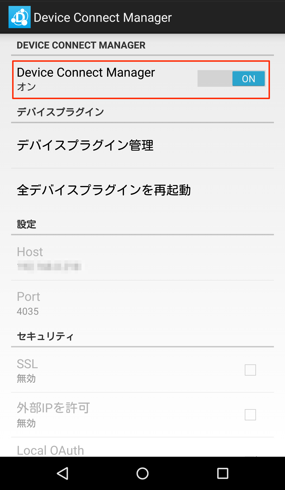
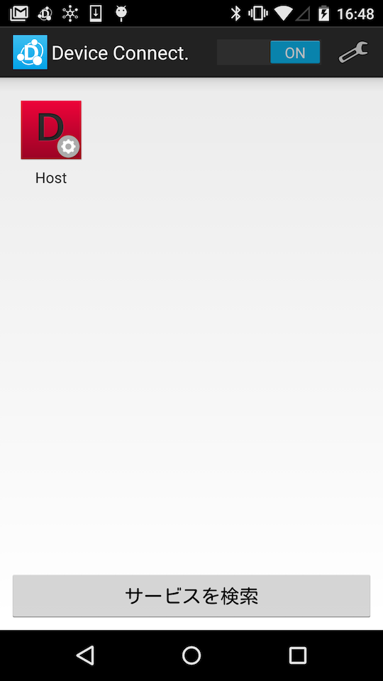

日本語説明は[こちら](README.md)を参照してください。

# About DeviceConnect-Android
Device Connect WebAPI in WebAPI which operates as a virtual server on the smartphone, it can be easy to use in a uniform description of various wearable devices and IoT devices from a Web browser and apps.
Device Connect Android will be the platform of DeviceConnect of Android version.

In this guide I will continue to discuss the following.

* Quick Start
* Project description
* Development of DeviceConnect app
* Generate a Javadoc of Device Connect SDK
* Build Manuals

Click [here](https://github.com/DeviceConnect/DeviceConnect-Docs/wiki)
 about DeviceConnect System.

# Quick Start
This tutorial explain how to build and run the Device Connect Manager.

## Build Device Connect Manager
Download DeviceConnect-Android source code.

```
$ curl -LkO https://github.com/DeviceConnect/DeviceConnect-Android/archive/master.zip
$ unzip master.zip
```

Build Device Connect Manager.

```
$ cd DeviceConnect-Android-master/dConnectManager/dConnectManager
$ gradle assembleDebug
```

Install Device Connect Manager.

```
$ adb install app/build/outputs/apk/app-debug.apk
```

## Starting Device Connect Manager

Please tap the Device Connect Manager icon.

<div>
    <a href="./assets/icon.png" target="_blank">
        
    </a>
</div>

By making it ON the field of DeviceConnectManager, you can start.

<div>
    <a href="./assets/manager_setting_ja.png" target="_blank">
        
    </a>
</div>

If Host's icon is displayed on the screen, Device Connect Mangaer is successfully started.<br>
If Host's icon cannot be displayed, please click the 'Search Service' button.

<div>
    <a href="./assets/manager_setting_ja.png" target="_blank">
        
    </a>
</div>

If you want to access from an external PC, enable `enable external IP` on the Device Connect Manager setting screen and restart Device Connect Manager.

Set the IP address to the value of Host displayed on the Device Connect Manager setting screen and execute the following CURL command.

```
curl  -X GET \
      -H 'Origin: localhost' \
      http://192.168.xxx.xxx:4035/gotapi/availability
```

If the following response is returned, you can check that Device Connect Manager is running.

```
{
    "result" : 0,
    "product" : "Device Connect Manager",
    "version":"v2.1.0
}
```

# Project description
## Device Plugin
| Project Name|Content  |
|:-----------|:---------|
|[dConnectDeviceAllJoyn](dConnectDevicePlugin/dConnectDeviceAllJoyn)|Device Plug-in for AllJoyn.|
|[dConnectDeviceAndroidWear](dConnectDevicePlugin/dConnectDeviceAndroidWear)|Device Plug-in for AndroidWear.|
|[dConnectDeviceAWSIoT](dConnectDevicePlugin/dConnectDeviceAWSIot)|Plug-in for AWSIoT.|
|[dConnectDeviceChromeCast](dConnectDevicePlugin/dConnectDeviceChromeCast)|Device Plug-in for ChromeCast.|
|[dConnectDeviceFaBo](dConnectDevicePlugin/dConnectDeviceFaBo)|Device Plug-in for FaBo.|
|[dConnectDeviceFPLUG](dConnectDevicePlugin/dConnectDeviceFPLUG)|Device Plug-in for F-PLUG.|
|[dConnectDeviceHeartRate](dConnectDevicePlugin/dConnectDeviceHeartRate)|Device Plug-in for HeartRate such as Mio Alpha.|
|[dConnectDeviceHitoe](dConnectDevicePlugin/dConnectDeviceHitoe)|Device Plug-in for Hitoe.|
|[dConnectDeviceHOGP](dConnectDevicePlugin/dConnectDeviceHOGP)|Device Plug-in for HOGP.|
|[dConnectDeviceHost](dConnectDevicePlugin/dConnectDeviceHost)|Device Plug-in for Android.|
|[dConnectDeviceHue](dConnectDevicePlugin/dConnectDeviceHue)|Device Plug-in for Hue.|
|[dConnectDeviceHVC](dConnectDevicePlugin/dConnectDeviceHVC)|Device Plug-in for HVC-C.|
|[dConnectDeviceHVCC2W](dConnectDevicePlugin/dConnectDeviceHVCC2W)|Device Plug-in for HVC-C2W.|
|[dConnectDeviceHVCP](dConnectDevicePlugin/dConnectDeviceHVCP)|Device Plug-in for HVC-P.|
|[dConnectDeviceIRKit](dConnectDevicePlugin/dConnectDeviceIRKit)|Device Plug-in for IRKit.|
|[dConnectDeviceKadecot](dConnectDevicePlugin/dConnectDeviceKadecot)|Device Plug-in for Kadecot.|
|[dConnectDeviceLinking](dConnectDevicePlugin/dConnectDeviceLinking)|Device Plug-in for Linking.|
|[dConnectDevicePebble](dConnectDevicePlugin/dConnectDevicePebble)|Device Plug-in for Pebble.|
|[dConnectDeviceSlackMessageHook](dConnectDevicePlugin/dConnectDeviceSlackMessageHook)|Plug-in for Slack.|
|[dConnectDeviceSmartMeter](dConnectDevicePlugin/dConnectDeviceSmartMeter)|Plug-in for Smart Meter.|
|[dConnectDeviceSonyCamera](dConnectDevicePlugin/dConnectDeviceSonyCamera)|Device Plug-in for SonyCamera such as QX10.|
|[dConnectDeviceSonySW](dConnectDevicePlugin/dConnectDeviceSonySW)|Device Plug-in for SonySmartWatch<br>※SmartWatch3 is not supported.|
|[dConnectDeviceSphero](dConnectDevicePlugin/dConnectDeviceSphero)|Device Plug-in for Sphero.|
|[dConnectDeviceTheta](dConnectDevicePlugin/dConnectDeviceTheta)|Device Plug-in for THETA.|
|[dConnectDeviceUVC](dConnectDevicePlugin/dConnectDeviceUVC)|Device Plug-in for UVC Camera.|
|[dConnectDeviceWebRTC](dConnectDevicePlugin/dConnectDeviceWebRTC)|Device Plug-in for WebRTC.|
|[dConnectDeviceTest](dConnectDevicePlugin/dConnectDeviceTest)|Device Plug-in for test of DeviceConnect.|
|[dConnectDevicePluginSDK](dConnectDevicePlugin/dConnectDevicePluginSDK)|SDK for creating DevicePlugin. dConnectSDKForAndroid necessary.|

## Device Connect Manager
| Project Name | Content  |
|:-----------|:---------|
|[dConnectManager](dConnectManager/dConnectManager)|Platform body of DeviceConnect.|
|[dConnectServer](dConnectManager/dConnectServer)|Server interface library of DeviceConnect.|
|[dConnectServerNanoHttpd](dConnectManager/dConnectServerNanoHttpd)|Server of the body of the DeviceConnect.|

## Device Connect SDK
| Project Name | Content |
|:-----------|:---------|
|dConnectApp|DeviceConnect operation check for app.|
|[dConnectSDKForAndroid](dConnectSDK/dConnectSDKForAndroid)|SDK of DeviceConnect. DevicePlugin development and SDK to be used for application development.|

# Development of DeviceConnect app

Application and using the DeviceConnect, regard the development of the application, please refer to the following pages.

* [Application Development Manual](https://github.com/DeviceConnect/DeviceConnect-Android/wiki/Application-Manual-for-Android-Studio)

If you want to develop a device plug-ins using the Device Connect Manager, please see this Application Development Manual.

* [Device Plug-in Development Manual](https://github.com/DeviceConnect/DeviceConnect-Android/wiki/DevicePlugin-Manual-for-Android-Studio-200)

# Generate a Javadoc of Device Connect SDK

```
$ cd DeviceConnect-Android-master/dConnectManager/dConnectManager
$ gradle generateJavadocForSDK
```

`DeviceConnectSDK-Javadoc` is created in the directory where gradle is executed and Javadoc of Device Connect SDK is output.

```
$ cd DeviceConnect-Android-master/dConnectManager/dConnectManager
$ gradle generateJavadocForPlugin
```

`DevicePluginSDK-Javadoc` is created in the directory where gradle was executed and Javadoc of Device Plugin SDK is output.

# Build Manuals
People who want to develop the DeviceConnectManager and device Plug-ins, please build in accordance with this build instructions.

* [DeviceConnectManager](https://github.com/DeviceConnect/DeviceConnect-Android/wiki/DeviceConnectManager-Build)
* [AllJoyn](https://github.com/DeviceConnect/DeviceConnect-Android/wiki/AllJoyn-Build)
* [ChromeCast](https://github.com/DeviceConnect/DeviceConnect-Android/wiki/ChromeCast-Build)
* [F-PLUG](https://github.com/DeviceConnect/DeviceConnect-Android/wiki/F-PLUG-Build)
* [FaBo](https://github.com/DeviceConnect/DeviceConnect-Android/wiki/FaBo-Build)
* [HeartRate](https://github.com/DeviceConnect/DeviceConnect-Android/wiki/HeartRateDevice-Build)
* [Hitoe](https://github.com/DeviceConnect/DeviceConnect-Android/wiki/Hitoe-Build)
* [HOGP](https://github.com/DeviceConnect/DeviceConnect-Android/wiki/HOGP-Build)
* [Host](https://github.com/DeviceConnect/DeviceConnect-Android/wiki/Host-Build)
* [Hue](https://github.com/DeviceConnect/DeviceConnect-Android/wiki/Hue-Build)
* [HVC](https://github.com/DeviceConnect/DeviceConnect-Android/wiki/HVCDevice-Build)
* [HVC-C2W](https://github.com/DeviceConnect/DeviceConnect-Android/wiki/HVCC2WDevice-Build)
* [HVC-P](https://github.com/DeviceConnect/DeviceConnect-Android/wiki/HVCPDevice-Build)
* [IRKit](https://github.com/DeviceConnect/DeviceConnect-Android/wiki/IRKit-Build)
* [Kadecot](https://github.com/DeviceConnect/DeviceConnect-Android/wiki/Kadecot-Build)
* [Linking](https://github.com/DeviceConnect/DeviceConnect-Android/wiki/Linking-Build)
* [Pebble](https://github.com/DeviceConnect/DeviceConnect-Android/wiki/Pebble-Build)
* [SonyCamera](https://github.com/DeviceConnect/DeviceConnect-Android/wiki/SonyCamera-Build)
* [SonySW](https://github.com/DeviceConnect/DeviceConnect-Android/wiki/SonySW-Build)
* [Sphero](https://github.com/DeviceConnect/DeviceConnect-Android/wiki/Sphero-Build)
* [Theta](https://github.com/DeviceConnect/DeviceConnect-Android/wiki/Theta-Build)
* [UVC](https://github.com/DeviceConnect/DeviceConnect-Android/wiki/UVC-Build)
* [AndroidWear](https://github.com/DeviceConnect/DeviceConnect-Android/wiki/AndroidWear-Build)
* [WebRTC](https://github.com/DeviceConnect/DeviceConnect-Android/wiki/WebRTC-Build)
* [AWSIoT](https://github.com/DeviceConnect/DeviceConnect-Android/wiki/AWSIoT-Build)
* [SlackMessageHook](https://github.com/DeviceConnect/DeviceConnect-Android/wiki/SlackBot-Build)
