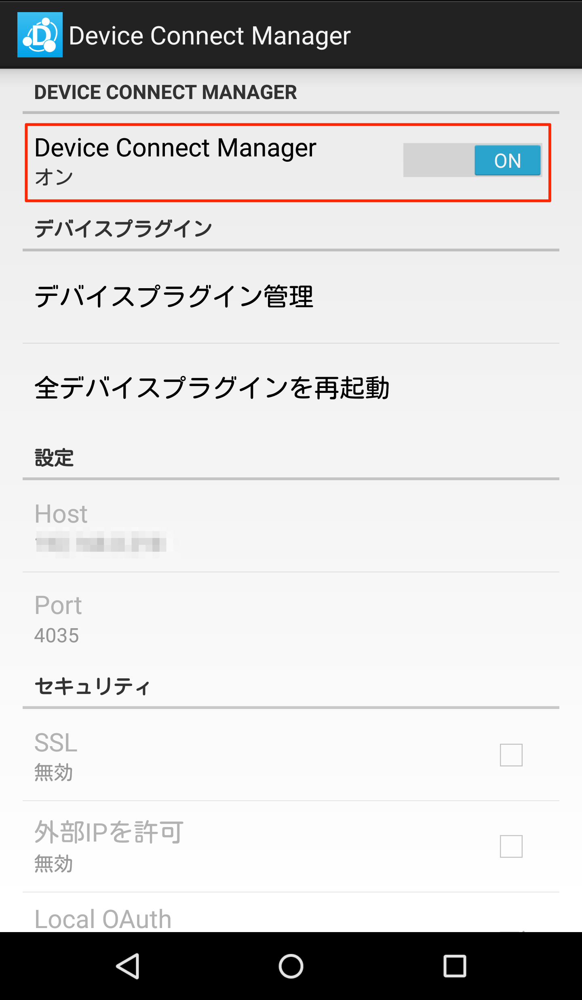
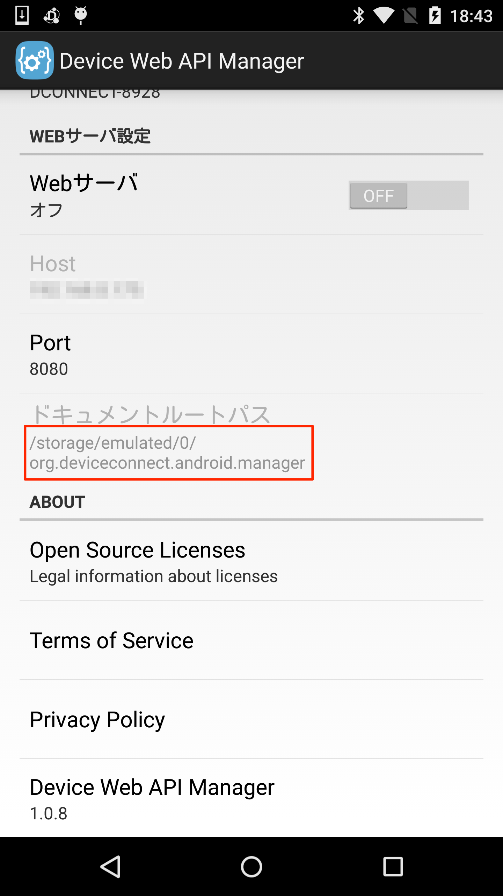
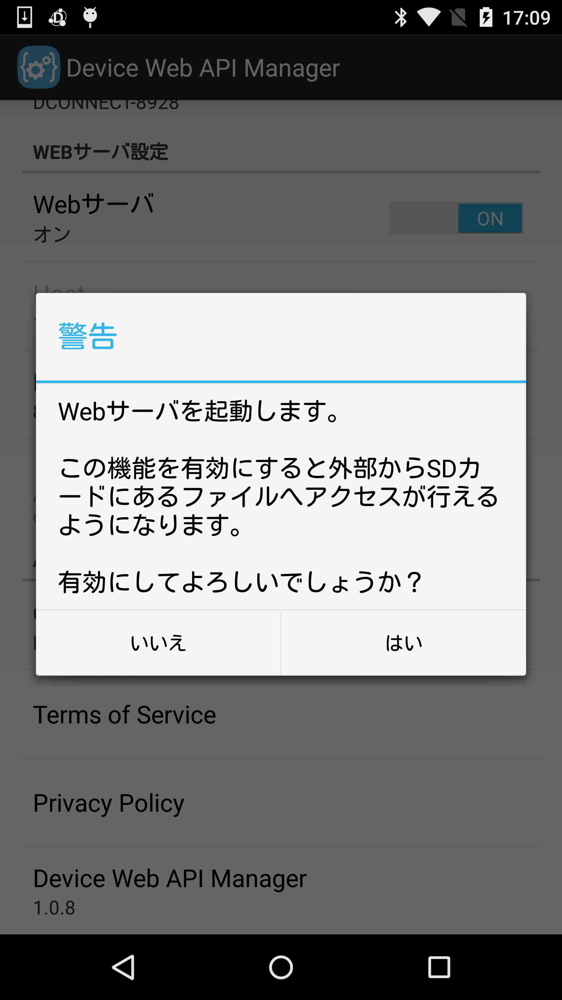

# DeviceConnect Android について

Device Connect WebAPIはスマートフォン上で仮想サーバとして動作するWebAPIで、様々なウェアラブルデバイスやIoTデバイスをWebブラウザやアプリから統一的な記述で簡単に利用することができます。
Device Connect AndroidはAndroid版のDeviceConnectのプラットフォームになります。

このガイドでは以下のことについて解説していきます。

* [プロジェクトの説明](#section1)
* [プロジェクトのインストール](#section2)
* [DeviceConnectManagerの起動](#section3)
* [動作確認](#section4)
* [Webサーバの起動](#section5)
* [DeviceConnectアプリの開発](#section6)

# <a name="section1">プロジェクトの説明</a>
## dConnectDevicePlugin
| プロジェクト名|内容  |
|:-----------|:---------|
|dConnectDeviceAllJoyn|AllJoynのデバイスプラグイン。|
|dConnectDeviceAWSIoT|AWSIoTのプラグイン。|
|dConnectDeviceChromeCast|Chromecastのデバイスプラグイン。 |
|dConnectDeviceFPLUG|F-PLUGのデバイスプラグイン。|
|dConnectDeviceFaBo|FaBoのデバイスプラグイン。|
|dConnectDeviceHeartRate|Mio AlphaなどのHeartRateのデバイスプラグイン。|
|dConnectDeviceHitoe|Hitoeのデバイスプラグイン。|
|dConnectDeviceHost|Androidのデバイスプラグイン。|
|dConnectDeviceHue|Hueのデバイスプラグイン。|
|dConnectDeviceHVC|HVC-Cのデバイスプラグイン。|
|dConnectDeviceHVCC2W|HVC-C2Wのデバイスプラグイン。|
|dConnectDeviceHVCP|HVC-Pのデバイスプラグイン。|
|dConnectDeviceIRKit|IRKitのデバイスプラグイン。|
|dConnectDeviceKadecot|Kadecotのデバイスプラグイン。|
|dConnectDeviceLinking|Linkingのデバイスプラグイン。|
|dConnectDevicePebble|Pebbleのデバイスプラグイン。|
|dConnectDeviceSonyCamera|QX10などのSonyCameraのデバイスプラグイン。|
|dConnectDeviceSonySW|SonySmartWatchデバイスプラグイン。<br>※SmartWatch3は未対応。|
|dConnectDeviceSlackMessageHook|Slackのプラグイン。|
|dConnectDeviceSphero|Spheroのデバイスプラグイン。|
|dConnectDeviceTheta|THETAのデバイスプラグイン。|
|dConnectDeviceUVC|UVCカメラのデバイスプラグイン。|
|dConnectDeviceAndroidWear|AndroidWearのデバイスプラグイン。|
|dConnectDeviceWebRTC|WebRTCのデバイスプラグイン。|
|dConnectDeviceTest|DeviceConnectのテスト用のデバイスプラグイン。|
|dConnectDevicePluginSDK|DevicePluginを作成するためのSDK。dConnectSDKForAndroidが必要。|


## dConnectManager
| プロジェクト名|内容  |
|:-----------|:---------|
|dConnectManager| DeviceConnectのプラットフォーム本体。|
|dConnectManagerTest|DeviceConnectManagerのテスト。|
|dConnectServer|DeviceConnectのServerのインターフェースライブラリ。|
|dConnectServerNanoHttpd|DeviceConnectのServerの本体。|

## dConnectSDK
| プロジェクト名|内容  |
|:-----------|:---------|
|dConnectApp| DeviceConnectの動作確認用アプリ。|
|dConnectSDKForAndroid| DeviceConnectのSDK。DevicePlugin開発とアプリ開発用に使用するSDK。|

# <a name="section2"> アプリケーションのインストール</a>
　DeviceConnectManagerやデバイスプラグインを開発したい人は、こちらのビルド手順書に従ってビルドしてください。

* [DeviceConnectManager](https://github.com/DeviceConnect/DeviceConnect-Android/wiki/DeviceConnectManager-Build)
* [AllJoyn](https://github.com/DeviceConnect/DeviceConnect-Android/wiki/AllJoyn-Build)
* [ChromeCast](https://github.com/DeviceConnect/DeviceConnect-Android/wiki/ChromeCast-Build)
* [F-PLUG](https://github.com/DeviceConnect/DeviceConnect-Android/wiki/F-PLUG-Build)
* [FaBo](https://github.com/DeviceConnect/DeviceConnect-Android/wiki/FaBo-Build)
* [HeartRate](https://github.com/DeviceConnect/DeviceConnect-Android/wiki/HeartRateDevice-Build)
* [Hitoe](https://github.com/DeviceConnect/DeviceConnect-Android/wiki/Hitoe-Build)
* [Host](https://github.com/DeviceConnect/DeviceConnect-Android/wiki/Host-Build)
* [Hue](https://github.com/DeviceConnect/DeviceConnect-Android/wiki/Hue-Build)
* [HVC](https://github.com/DeviceConnect/DeviceConnect-Android/wiki/HVCDevice-Build)
* [HVC-C2W](https://github.com/DeviceConnect/DeviceConnect-Android/wiki/HVCC2WDevice-Build)
* [HVC-P](https://github.com/DeviceConnect/DeviceConnect-Android/wiki/HVCPDevice-Build)
* [IRKit](https://github.com/DeviceConnect/DeviceConnect-Android/wiki/IRKit-Build)
* [Kadecot](https://github.com/DeviceConnect/DeviceConnect-Android/wiki/Kadecot-Build)
* [Linking](https://github.com/DeviceConnect/DeviceConnect-Android/wiki/Linking-Build)
* [Pebble](https://github.com/DeviceConnect/DeviceConnect-Android/wiki/Pebble-Build)
* [SonyCamera](https://github.com/DeviceConnect/DeviceConnect-Android/wiki/SonyCamera-Build)
* [SonySW](https://github.com/DeviceConnect/DeviceConnect-Android/wiki/SonySW-Build)
* [Sphero](https://github.com/DeviceConnect/DeviceConnect-Android/wiki/Sphero-Build)
* [Theta](https://github.com/DeviceConnect/DeviceConnect-Android/wiki/Theta-Build)
* [UVC](https://github.com/DeviceConnect/DeviceConnect-Android/wiki/UVC-Build)
* [AndroidWear](https://github.com/DeviceConnect/DeviceConnect-Android/wiki/AndroidWear-Build)
* [WebRTC](https://github.com/DeviceConnect/DeviceConnect-Android/wiki/WebRTC-Build)
* [AWSIoT](https://github.com/TakayukiHoshi1984/DeviceConnect-Android/wiki/AWSIoT-Build)
* [SlackMessageHook](https://github.com/TakayukiHoshi1984/DeviceConnect-Android/wiki/SlackBot-Build)

　なお、[こちら](https://github.com/DeviceConnect/DeviceConnect-Docs/tree/master/Bin/Android)からもapkを取得することができます。
　インストール方法につきましては、以下のようにコマンドラインからコマンドの実行することができます。<br>
 ここでは、Device Manager本体とHOSTデバイスプラグインのみをインストールします。
他にもデバイスプラグインがありますので、必要に応じてインストールしてください。

```
　adb install dConnectManager.apk
　adb install dConnectDeviceHost.apk
```

adbコマンドにつきましては、Android SDKを確認してください。

# <a name="section3">DeviceConnectManagerの起動</a>
 DeviceConnectManagerのアイコンをタップしてください。
 <center><a href="./assets/icon.png" target="_blank">
</a><br></center>

DeviceConnectManagerの欄をONにすることによって、起動することができます。

<center><a href="./assets/manager_setting_ja.png" target="_blank">
</a></center>

# <a name="section4">動作確認</a>

 Chromeブラウザのアドレスに、「http://localhost:4035/gotapi/availability」を入力してください。
以下のようなJSONのレスポンスが返って来れば、DeviceConnectManagerが動作していることが確認できます。<br>
<br>

 <center><a href="./assets/availability.png" target="_blank">
</a></center>

 リクエスト

 ```
 GET http://localhost:4035/gotapi/availability
 ```

 レスポンス

 ```
 {
     "product":"Device Connect Manager",
     "version":"x.x",
     "name":"Manager-0702",
     "uuid":"xxxx-yyyyy-zzz-aaaa",
     "result":0,
}
 ```

 availability以外のAPIには、基本的にはアクセストークンが必要になるためにchromeブラウザのアドレスでは簡単に確認することができません。
Device Connect の具体的な利用法に関しましては、[こちら](https://github.com/DeviceConnect/DeviceConnect-Android/wiki/Application-Manual)のWikiをご参考にしてください。


# <a name="section5">Webサーバの起動</a>
[DeviceConnect-JSのdConnectJavascriptApp](https://github.com/DeviceConnect/DeviceConnect-JS/tree/master/dConnectJavascriptApp)をAndroid端末のSDカード内に配置し、アクセスすることができます。

dConnectManagerの設定画面の以下の項目をONにすることによりWebサーバを起動することができます。<br>
その時のドキュメントルートは、SDカードのorg.deviceconnect.android.manager直下になります。<br>

<center><a href="./assets/webserver_setting.png" target="_blank">
</a></center><br>

`/storage/emulated/0/org.deviceconnect.android.manager/index.html`にHTMLファイルを配置した場合は、ブラウザでは、`http://localhost:8080/index.html`のようにURLを入力することでアクセスすることができます。<br>
<br>
その時、この機能がセキュリティホールになる恐れがあるため、以下のように確認ダイアログが表示されるようになっています。<br>
<br>

<center><a href="./assets/webserver.png" target="_blank">
</a></center><br>


# <a name="section6">DeviceConnectアプリの開発</a>
 DeviceConnectを使ったアプリケーションおよび、アプリケーションの開発に関しましては、以下のページを参考にしてください。

* [アプリケーション開発マニュアル(AndroidStudio)](https://github.com/DeviceConnect/DeviceConnect-Android/wiki/Application-Manual-for-Android-Studio)
<br>
Device Connect Managerを使用したデバイスプラグインを開発したい場合には、こちらのアプリケーション開発マニュアルをご参照ください。

* [デバイスプラグイン開発マニュアル(AndroidStudio)](https://github.com/DeviceConnect/DeviceConnect-Android/wiki/DevicePlugin-Manual-for-Android-Studio)
